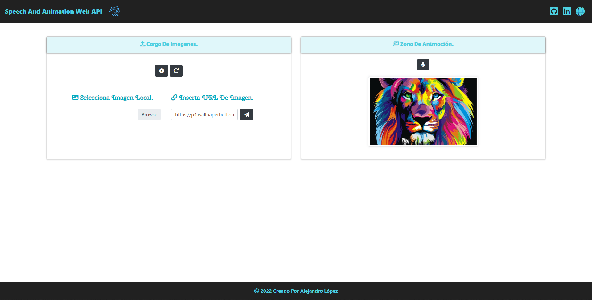

# <h1 align="center" style="color: #80cbc4;"> Speech Recognition And Just Animation API</h1> 
  

This web application allows you to see some animations of the images using speech recognition, through the `Web Speech API` and using the `Web Animations API` which allows us to create animations and control their playback with JavaScript.

The `Web Animations API` allows for synchronizing and timing changes to the presentation of a Web page. It does so by combining two models: the Timing Model and the Animation Model.

The `Web Speech API` allows for Speech Recognition in the browser, using JavaScript. This opens up many new possibilities regarding user interaction with websites and web applications.
  

## 
 Requirements 

- [HTML5](https://developer.mozilla.org/es/docs/Web/HTML) 
- [CSS3](https://developer.mozilla.org/es/docs/Web/CSS)
- [JavaScript](https://developer.mozilla.org/es/docs/Web/JavaScript)

## 
 References 

- [Web Speech API](https://developer.mozilla.org/en-US/docs/Web/API/Web_Speech_API)
- [Speech Recognition](https://developer.mozilla.org/en-US/docs/Web/API/SpeechRecognition) 
- [Just Animate](https://just-animate.github.io/)
- [Web Animations API](https://just-animate.github.io/waapi/)

  

## 
 Screenshot Project 💻 

🔶 [Project Website](https://alejandro-lopez.futuretecware.com/Speech-And-Animation-Web-Api/index.html)

